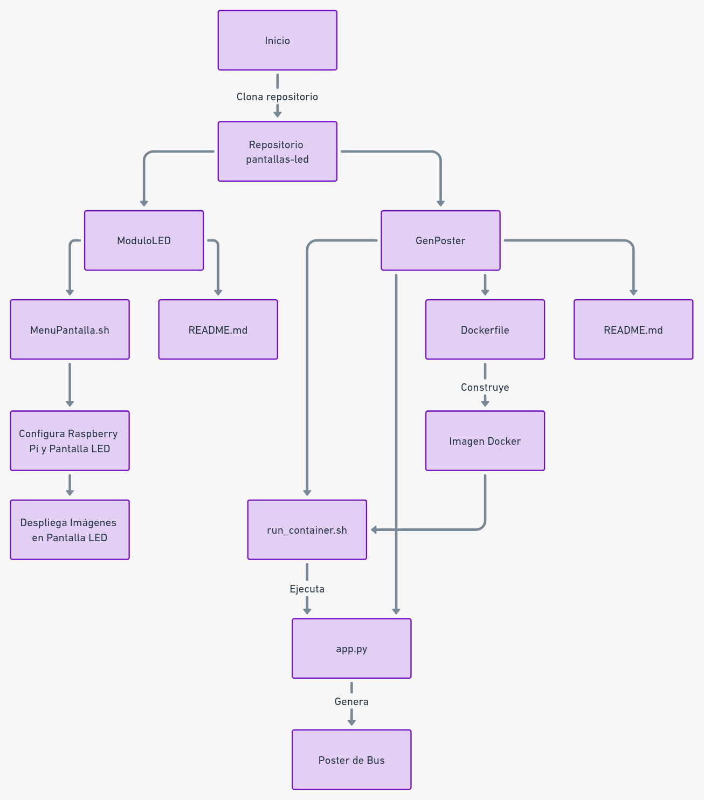

# Visualización para Pantallas LED de Paradas de Bus

Este proyecto genera visualizaciones para pantallas LED en paradas de autobuses, mostrando información como tiempos de llegada y detalles de rutas.

### Paso 1: Clonar el Repositorio

Para comenzar, clona el repositorio y navega a su directorio:

```bash
git clone https://github.com/diegoalrv/pantallas-led
cd pantallas-led
```

## Tabla de Contenidos
1. [Guía de configuración para Modulo LED](#guia-de-configuración-para-modulo-led)
2. [Generación de Póster de Bus](#generación-de-póster-de-bus)
3. [Integración, Comunicación y Configuración](#integración-comunicación-y-configuración)
4. [Esquema del Proyecto](#esquema-del-proyecto)

## Guía de configuración para Modulo LED
En esta sección encontrarás una guía completa para configurar módulos LED con una Raspberry Pi. Se detalla la lista de materiales necesarios, como la Raspberry Pi y paneles LED P4, y se explica el proceso de conexión tanto de datos como eléctrica. Además, se incluyen instrucciones para configurar la Raspberry Pi, con un enfoque en ajustes como el número de filas y columnas de píxeles, brillo, y mapeo GPIO. Imágenes y diagramas de conexión complementan las instrucciones para facilitar el montaje.
Para más detalles, vea el [README](./ModuloLED/README.md).

## Generación de Póster de Bus
Este apartado aborda cómo generar visualizaciones para pantallas LED en paradas de autobuses usando Docker. Se describe el proceso de construcción de la imagen Docker y la ejecución del contenedor con el script ```run_container.sh```. El script ```app.py```, que se ejecuta automáticamente, se encarga de calcular el tiempo de llegada de los autobuses y generar visualizaciones relevantes. Aunque actualmente se trabaja con datos de prueba, se planea integrar respuestas de un endpoint en el futuro. También se proporciona información sobre cómo acceder a las imágenes generadas.
Para más detalles, vea el [README](./GenPoster/README.md).

## Integración, Comunicación y Configuración
*Contenido pendiente.*

## Esquema de Funcionamiento del Sistema

A continuación se presenta un esquema que ilustra el funcionamiento actual del sistema en el repositorio `pantallas-led`. Este diagrama muestra cómo se relacionan los distintos componentes y archivos del proyecto, desde la clonación del repositorio hasta la ejecución de los scripts específicos en las subcarpetas `ModuloLED` y `GenPoster`.


